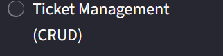

You got it. Here is the complete, single block of text for your `README.md` file, ready to be copied and pasted into one file.

NB: To display the data, navigate to the CRUD section of each page. There, you will find a button that you must select. Following this action, please reload the application and log back in to view the displayed data. As the image below:



````markdown
# Multi-Domain Intelligence Platform

This platform is a Streamlit-based application designed to centralize and analyze data across three key domains: Cybersecurity, Data Science, and IT Operations. It features a secure login system with hashing, full CRUD functionality for data management, and an integrated AI Assistant for contextual analysis.

## Prerequisites

Before running the application, ensure you have the following installed:

* **Python 3.8+**
* **A New OpenAI API Key** (Remember to revoke any compromised keys.)

## 1. Project Setup

Follow these steps to set up your environment and install the necessary dependencies.

### 1.1 Create a Virtual Environment (Recommended)

Navigate to your project directory and create a virtual environment:

```bash
python -m venv venv
````

Activate the virtual environment:

  * **Windows:**
    ```bash
    .\venv\Scripts\activate
    ```
  * **macOS / Linux:**
    ```bash
    source venv/bin/activate
    ```

### 1.2 Install Dependencies

You will need the `streamlit` library, the official `openai` Python client, and likely other common data handling libraries (like `pandas` and a password hashing library, e.g., `bcrypt`).

Create a `requirements.txt` file listing all necessary packages (e.g., `streamlit`, `openai`, `pandas`, `bcrypt`), and then run:

```bash
pip install -r requirements.txt
```

## 2\. Configuration: Setting the API Key

The application relies on an active OpenAI API Key for the AI Assistant feature.

1.  Open the **`services/ai_assistant.py`** file.
2.  Find the `HARDCODED_API_KEY` placeholder.
3.  **Replace `"YOUR_NEW_API_KEY_HERE"`** with your actual, new OpenAI API key (starting with `sk-proj-...`).

<!-- end list -->

```python
# In services/ai_assistant.py:
HARDCODED_API_KEY = "YOUR_NEW_API_KEY_HERE"
```

## 3\. Launching the Application

The Multi-Domain Intelligence Platform is a Streamlit application launched via the command line.

1.  Ensure your virtual environment is active.
2.  Navigate to the root directory of your project.
3.  Run the following command, replacing `<your_main_app_file>.py` with your main Streamlit entry point:

<!-- end list -->

```bash
streamlit run <your_main_app_file>.py
```

  * **Example (If your main file is `Home.py`):**
    ```bash
    streamlit run Home.py
    ```

### Post-Launch

  * The application will automatically open in your default web browser (usually at `http://localhost:8501`).
  * The first screen will be the **Login Page**, where new users can register an account using the security features you implemented.

<!-- end list -->

```
```